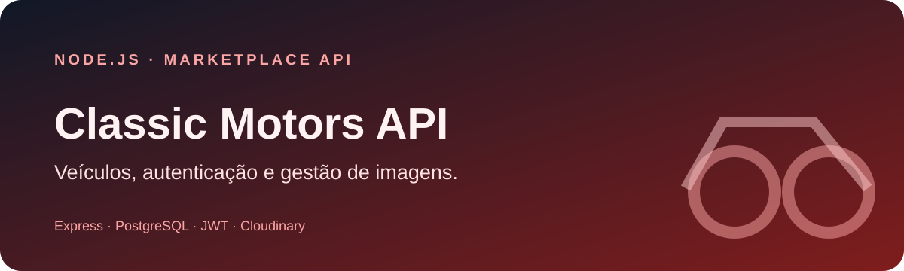
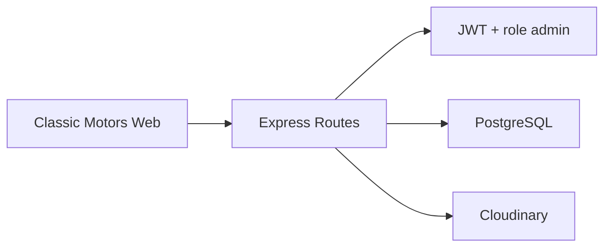

<p align="center">
  
</p>

<p align="center">
  <a href="https://github.com/Gustavo-tec0110/Classicmotors--BACK/actions/workflows/ci.yml"></a>
  <a href="https://webmotors-clone-back.onrender.com/health"></a>
  
  
  
</p>

# Classic Motors API

Backend REST para um marketplace automotivo. A API disponibiliza o catálogo publicamente e protege cadastro, atualização e remoção de veículos com autenticação JWT e autorização por papel administrativo.

Este repositório forma o backend do projeto **Classic Motors**. A interface está em [Classicmotors-FRONT](https://github.com/Gustavo-tec0110/Classicmotors-FRONT).

## Screenshots

> Placeholder: uma captura da futura documentação OpenAPI será adicionada quando a interface interativa da API estiver disponível.

A interface correspondente está documentada no repositório [Classicmotors-FRONT](https://github.com/Gustavo-tec0110/Classicmotors-FRONT).

## Demonstração

- **API:** [webmotors-clone-back.onrender.com](https://webmotors-clone-back.onrender.com)
- **Health check:** [webmotors-clone-back.onrender.com/health](https://webmotors-clone-back.onrender.com/health)
- **Frontend:** [classicmotors-front.onrender.com](https://classicmotors-front.onrender.com)

O serviço utiliza a modalidade gratuita do Render e pode levar alguns segundos para responder após um período de inatividade.

## Funcionalidades

- listagem pública de veículos;
- cadastro e login com senha protegida por bcrypt;
- tokens JWT com expiração;
- autorização de operações administrativas;
- criação, atualização e remoção de anúncios;
- upload de imagens para Cloudinary;
- persistência em PostgreSQL;
- health check e respostas de erro estruturadas;
- limite de tamanho e quantidade para uploads.

## Arquitetura



## Tecnologias

Node.js, Express, PostgreSQL, JWT, bcrypt, Multer, Cloudinary e Node Test Runner.

## Como executar localmente

Requisitos: Node.js 20+ e PostgreSQL.

```bash
git clone https://github.com/Gustavo-tec0110/Classicmotors--BACK.git
cd Classicmotors--BACK
npm ci
```

Copie `.env.example` para `.env`, crie as tabelas e inicie a API:

```bash
npm run db:init-users
npm run db:init-cars
npm run dev
```

A API estará em `http://localhost:3000` e o health check em `/health`.

## Variáveis de ambiente

| Variável | Finalidade |
|---|---|
| `DATABASE_URL` | conexão PostgreSQL |
| `DATABASE_SSL` | habilita SSL para bancos gerenciados |
| `JWT_SECRET` | assinatura dos tokens |
| `ADMIN_EMAILS` | e-mails autorizados como administradores |
| `CORS_ORIGINS` | origens web permitidas, separadas por vírgula |
| `CLOUDINARY_*` | credenciais de armazenamento de imagens |
| `PORT` | porta HTTP |

Nunca versione o arquivo `.env`.

## Endpoints

| Método | Rota | Acesso |
|---|---|---|
| `GET` | `/health` | público |
| `POST` | `/auth/register` | público |
| `POST` | `/auth/login` | público |
| `GET` | `/carros` | público |
| `POST` | `/carros` | administrador |
| `PUT` | `/carros/:id` | administrador |
| `DELETE` | `/carros/:id` | administrador |

## Testes e qualidade

```bash
npm run check
npm test
```

A suíte atual valida health check e tratamento de rota inexistente sem exigir banco. Casos de integração com PostgreSQL continuam no roadmap.

## Estrutura do projeto

```text
app.js                  # composição do Express
index.js                # inicialização do servidor
src/
├── config/             # Cloudinary e Multer
├── controllers/        # autenticação
├── database/           # pool e inicialização de schema
├── middlewares/        # JWT e autorização
├── models/             # acesso a usuários
├── routes/             # autenticação e veículos
└── services/           # upload de mídia
test/                   # testes HTTP
```

## Aprendizados

- organização de uma API Express por responsabilidades;
- autenticação stateless com JWT e autorização baseada em papel;
- integração segura entre PostgreSQL, upload de mídia e clientes web.

## Limitações conhecidas

- o schema ainda é criado por scripts, sem ferramenta de migrations;
- validações de payload precisam ser ampliadas;
- o fluxo opcional de Google OAuth está preservado como código experimental e não faz parte do caminho suportado;
- faltam testes de integração com PostgreSQL e Cloudinary.

## Próximos passos

- [ ] adotar migrations transacionais;
- [ ] validar payloads com schema;
- [ ] adicionar rate limiting e cabeçalhos de segurança;
- [ ] cobrir autenticação e CRUD em testes de integração;
- [ ] remover ou concluir o fluxo experimental de Google OAuth.

## Como contribuir

Abra uma issue descrevendo o problema antes de mudanças de arquitetura. Pull Requests devem incluir validação automatizada, não podem conter credenciais e precisam preservar o contrato atual da API.

## Licença

Distribuído sob a licença MIT. Consulte [LICENSE](LICENSE).

## Autor

Desenvolvido por **Gustavo Lopes** — [GitHub](https://github.com/Gustavo-tec0110).
